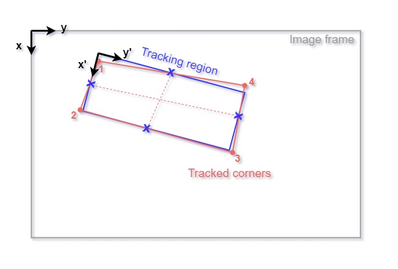

# manual-point-tracking

Matlab script for object tracking from videos.
The code reads a video and divides it into the desired number of frames.
The user can click with the mouse on such frames to save the coordinates of the objects that need to be tracked.
The code provides the possibility to convert the coordinates into the reference system defined by the user (by clicking on the four corners of the tracking region, assuming it is rectangular).

manual_point_tracking.m is the main file that has to be run. The other functions in the subfolder execute specific tasks.

## Input Parameters

The input variables are the following:

1.  the folder that contatins the videos (*video_folder*);
2.  output main folder to save all output data (*output_folder*)
3.  name of the video to be tracked (*video_name*)
4.  number of objects to track in each frame (*n_object*)
5.  tracking start point [seconds] (*track_start*)
6.  tracking end point [seconds] (*track_end*)
7.  sampling frequency [frames/seconds] (*track_fps*)

## Output data

The output files are the following:
-  a text file named *'input_parameters.txt'* with all the setting parameters for the tracking, video parameters, date and time
-  a folder named 'Frames' which contains all the images used for tracking in .jpg format
-  a *'CORNERS_###.csv'* file that contains the relative coordinates of the corners of the tracking region 
-  a *'TRACKED_RAW_###.csv'* file with all the relative coordinates of the tracked objects. Coordinates are referenced with the image dimensions and orientation (See (xy) reference system in the figure below, origin on the TOP LEFT corner)
-  a *'TRACKED_REFERENCED_###.csv'* file with all the relative coordinates of the tracked objects referenced to the tracking region, assumed rectangular (See (x'y') reference system in the figure below origin on the TOP LEFT corner)

